# CashView
## Pull in and view your financial data in one place!

[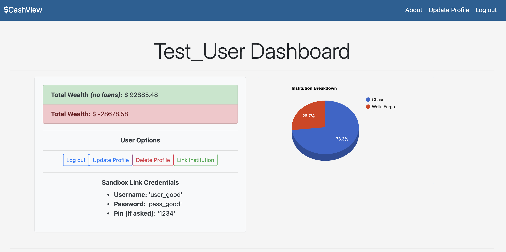](https://wealth-and-budget.herokuapp.com/)

## Description:
This website acts as a personal finance dashboard. It allows users to make a profile and pull financial data from all of their financial institutions into one place. The app itself aggregates balances from all of the user's accounts, displaying their overall worth (with and without loans). It also uses graphics to illustrate the breakdown of the user's financial institutions and what percentage of their overall wealth is in each. Below the dashboard there is an account-level breakdown of each financial institution listed that displays the individual balances based on account type. This was completed in approximately 60 hours as part of Springboard Software Engineering Program.

## Table of Contents
1. [ Tech Stack ](#Tech-Stack)
    - [ Front-end ](#Front-end)
    - [ Back-end ](#Back-end)
    - [ Database ](#Database)
    - [ APIs Integrated ](#APIs)
2. [ Database Schema ](#Schema)
3. [ Deployment ](#Deployment)
4. [ Developer ](#Developer)
5. [ Features ](#Features)
    - [ User Features ](#UserFeatures)
        - [ Registration ](#Registration)
        - [ Login and Demo User ](#LoginAndDemo)
        - [ User Editing ](#EditUser)
        - [ User Deletion ](#DeleteUser)
    - [ Financial Institution and Account Features ](#FandAFeatures)
        - [ Adding a Financial Institution and Accounts ](#AddUFI)
        - [ Updating Financial Institution and Accounts ](#UpdateUFI)
        - [ Deleting Financial Institution and Accounts ](#DeleteUFI)
    - [ BudgetTracker Features ](#BTFeatures)
        - [ Adding a BudgetTracker](#AddBT)
        - [ Editing a BudgetTracker ](#EditBT)

## Tech Stack

### Front-end
JavaScript, Axios, HTML5, CSS, Bootstrap, jQuery, GoogleChart.js

### Back-end
Python, Flask, ORM: SQLAlchemy, Jinja2, WTForms, Bcrypt, Cron

### Database
Postgres

### APIs integrated
- [ Plaid ](https://plaid.com/docs/api)
- [ Twilio ](https://www.twilio.com/docs)

## Schema
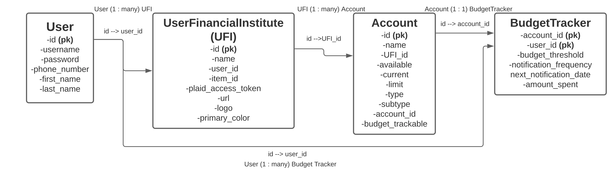

## Deployment
CashView is deployed on heroku at [https://wealth-and-budget.herokuapp.com/](https://wealth-and-budget.herokuapp.com/)

## Developer
### Bryce Beckenbach

Please feel free to reach out!
- Email: [brycebeckenbach@gmail.com](mailto:brycebeckenbach@gmail.com)
- [ Linkedin ](https://www.linkedin.com/in/bryce-beckenbach-52a5276a/)

## Features:

### User Features

#### Registration
User Registration goes through the User model on the backend, user enters desired username, password, phone number, first name, last name, and desired account type (sandbox or development (more on that later)). All information is required and username must be unique for the model to generate a User instance. Password is run through Bcrypt hashing function where the output is stored in the database.

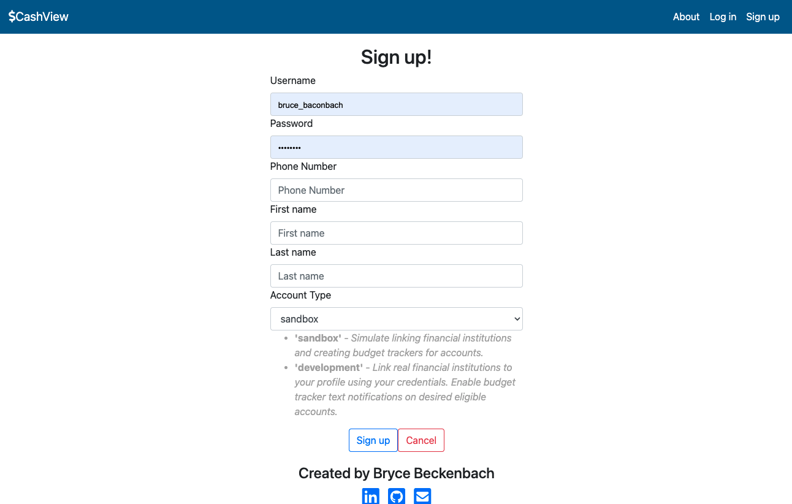

#### Login and Demo User
Login authentication occurs on the User model as well. If a User logs in with correct username/password pair, User authenticate method returns the User instance, if not it returns False.

To reduce barrier of entry of someone trying to experience the App, I integrated a 'Demo User' button on the Login page. This uses JavaScript and jQuery behind the scenes to enter credentials:
- Username: Test_User
- Password: pass_good

**NOTE:** There is backend logic to protect Test-User from modification or deletion

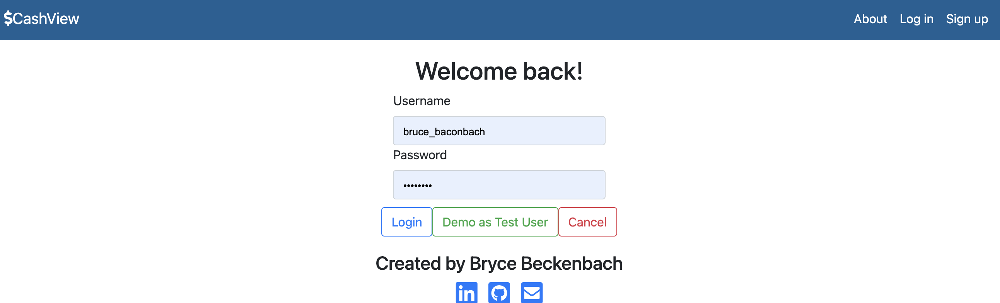

#### User Editing
Once a user is logged in, they will see 'Update Profile' as an option on their navbar and under 'User Options' on the dashboard, there is an 'Update Profile' button a user can click which will lead them to a portal to edit their profile. All of their current information is populated into the input fields of the form. Once they have updated their information to the desired values and enter their password at the bottom to confirm the changes, they can click 'Update' to have their changes made in the database.

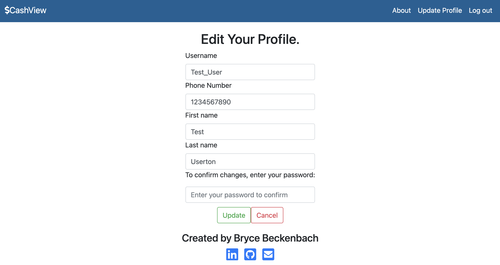

#### User Deletion
Once a user is logged in, they will see an option to 'Delete Profile' under 'User Options'. Once they click this, their User instance will be removed from the database on the back-end and they will be redirected to the welcome page of CashView on the frontend. There is a cascading deletion set up in the database schema so all FinancialInstitutions, Accounts, and BudgetTrackers will be deleted as well.

### Financial Institution and Account Features

#### Adding a Financial Institution and Accounts
Using the Plaid API, a user can securely add their credentials to Plaid's Link interface that is embedded in the dashboard. **These credentials are not stored in the any area of CashView at any point**. To avoid this being an issue, I made sure users that sign up have the option of having a **development** account, which deals with real bank data, or a **sandbox** account, which deals with dummy bank accounts from Plaid. The Demo user experience is a **sandbox** account as well. 

Once on the dashboard page, a user clicks on 'Link Institution' under 'User Options'.

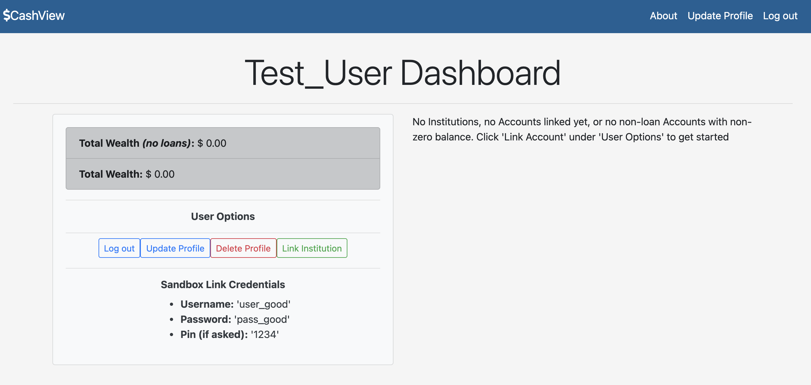

After the user does this, Plaid's Link interface experience will appear. You will be able to choose your financial institution of choice from a list, then enter the required credentials to pull the data into CashView. If you have a **development** account, you enter your real credentials, if you have a **sandbox** account you enter the information under 'User Options' in the image above (can also be seen at the footer of the Link portal):
- Username: user_good 
- Password: pass_good

If the correct information is entered, CashView will go through the [ Plaid Token exchange process ](https://plaid.com/docs/link/) and receive an **access_token** associated with the specified financial institution. Using this access_token, the app makes two further API calls to Plaid:
1. To retrieve data on the financial institution (called an 'item' in Plaid's vernacular) [see Response Fields](https://plaid.com/docs/api/institutions/#institutionsget_by_id)
2. To retrieve data on accounts held by that financial institution [see Response Fields](https://plaid.com/docs/api/products/#accountsbalanceget)

Financial Institution and Account/s instances are created in the CashView database then json data is sent to the dashboard to create the required HTML to represent the instances. If a user already has Financial Institutions and Accounts associated with their User instance, Jinja2 templates create the required HTML upon page load.

*(Financial Institution in CashView Dashboard)*
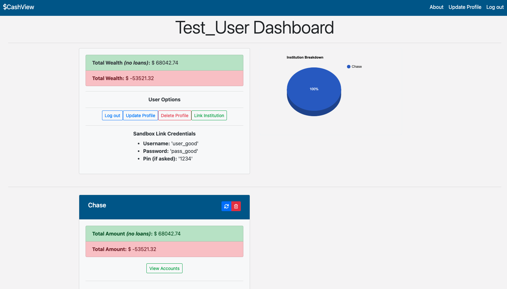

*(Same Financial Institution in CashView Dashboard with some Accounts deleted and view uncollapsed)*
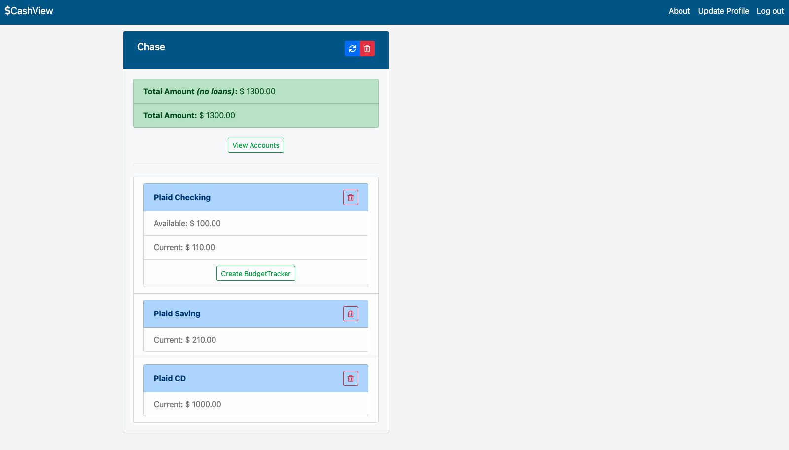

#### Updating Financial Institution and Accounts
For each Financial Institution on the dashboard, there is an 'Update' icon. This is for manual refreshing of account balances. This will make a call to the back-end to grab all the Plaid account IDs associated with that Financial Institution in the CashView database and get the most up-to-date balance information for these accounts from Plaid. This data will be sent back to the front-end and the HTML will be updated to reflect the most recent balances.

*(Top right blue refresh icon)*
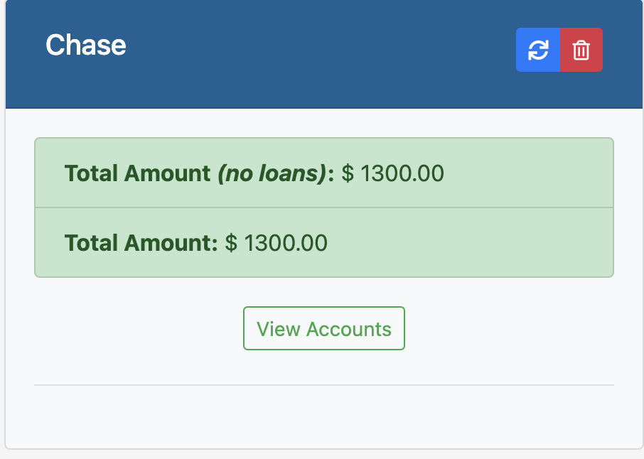

#### Deleting Financial Institution and Accounts
For each Financial Institution and account (uncollapsed) on the dashboard, there is a 'Delete' icon. This is for deletion of desired Accounts you do not want to track and Financial Institutions, respectively. This will make a call to the back-end to delete the desired account or Financial Institution in the CashView database. Upon deletion, your overall wealth and balance information at the Financial Institution level will change (if you delete accounts from a Financial Institution). Updated roll-up balance data will be sent back to the front-end and the HTML will be updated to reflect the most recent balances.

*(Financial Institution deletion: Top right of 'Chase', red deletion button icon)*

*(Account deletion: Top right of 'Plaid Checking' red deletion button icon)*
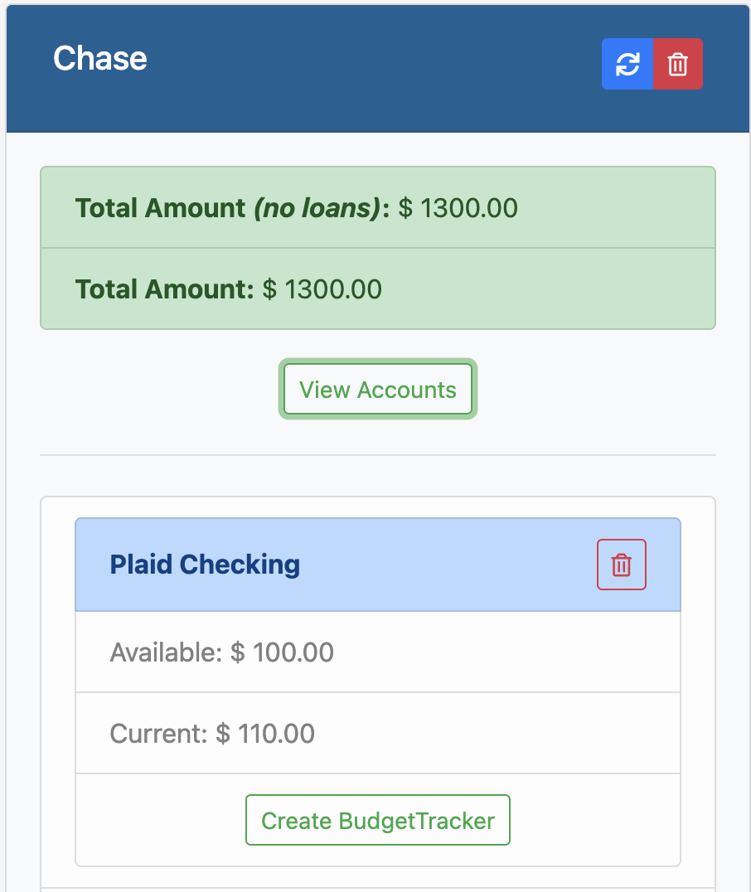

### BudgetTracker Features

#### Adding a BudgetTracker
If an Account is elegible (is of type 'credit' or sub-type 'checking'), it will have a 'Create BudgetTracker' button displayed at the bottom. Clicking this will bring the user to a BudgetTracker creation form for that particular Account where they can enter their desired 'Monthly Budget Threshold' amount (must be greater than $0) and their desired Notification Frequency that they would like to receive text notifications at (must be between 1 and 15 days). These texts updates will occur at frequency multiples of the day frequency they enter (e.g. if they enter 2, they would receive a text notification every other day). This is enabled by a script that runs once each day to:
- Update the most recent amount spent on the BudgetTracker
- See if the notification date on the budget tracker is equal to the date that day
    -If it is not, it does nothing
    -If it **is**, it fires off a text notification with the amount spent compared to the budget threshold and updates the next notification date using the desired notification frequency

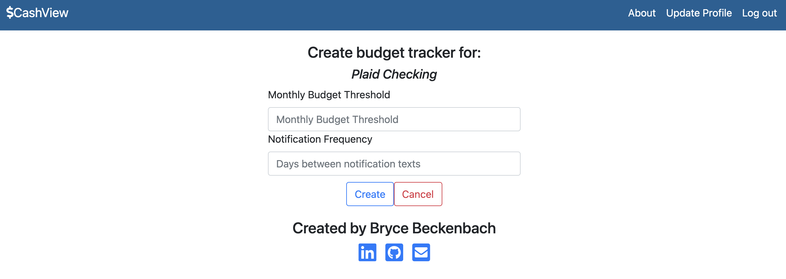

The BudgetTracker will then appear on the Dashboard under the associated Account displaying all information (Budget Threshold, Amount Spent, Notification Frequency, Next Notification Date) which is updated by the script that runs daily.

**NOTE:** If the User's account_type is 'sandbox', they are ineligible for text notifications. I am also running the freemium of Twilio, so unless your cellphone number is verified under my account for the web app, you would not receive a text message. If you would like to use the text notification feature, you would need to get your own API keys for Plaid and Twilio and run this app locally.

#### Editing a BudgetTracker
Once a BudgetTracker is created, it will appear on the Dashboard where it can be edited or deleted. To edit, click the 'edit' icon at the bottom of the BudgetTracker. This will direct the User to the Update BudgetTracker form where the user can modify their Budget Threshold and/or their Notification Frequency.

*(BudgetTracker Update: Bottom of BudgetTracker blue 'edit' icon)*

*(BudgetTracker Update Form)*
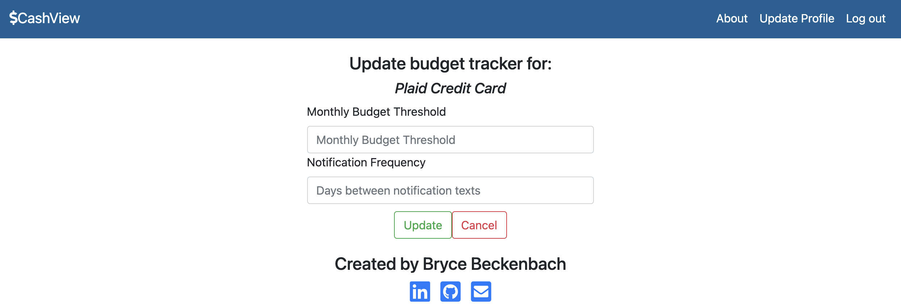

1. Full CRUD on all resources (User, UserFinancialInstitution, Account, BudgetTracker)
3. Capability to securely pull financial institutions into application through Plaid 
4. Displays aggregated information of all financial institutions for quick view, aggregate of all accounts at singular financial institution, and more granular breakdown of each account
5. Displays graphical 3D pie-chart breakdown of where a user's wealth is
6. Capability to create a customized BudgetTracker with desired budget threshold and notification frequency for eligible accounts (type: credit or sub-type: checking)
7. Scheduled auto-update of all accounts, grabbing the most recent account balance information daily
8. Scheduled auto-notification SMS with most up to date 'amount spent' out of 'budget threshold' for users for budget tracking through Plaid and Twilio

Standard User Flow:
1. User signs-up or logs in
2. User views dashboard where they:
    - add their financial institution/s
    - create/update BudgetTrackers for desired accounts
    - update their user profile information 
    - logout or delete profile

Notes:
1. Job Scheduling:
    - Script is scheduled to run on Heroku
    - If you choose to run this locally, include following code in main app and follow directions below:
        - code:
            **Dependencies to import**
            from flask_crontab import Crontab
            from CronJobs.UFI_jobs import scheduled_daily_refresh_all_accounts
            from CronJobs.BudgetTracker_jobs import scheduled_budget_tracker_jobs
            ** Initializations ***
            crontab = Crontab(app)
            **CRON schedule function definition**
            @crontab.job(minute=0, hour=12)
            def scheduled_jobs():
               scheduled_daily_refresh_all_accounts(plaid_inst)
               scheduled_budget_tracker_jobs(plaid_inst, twilio_inst)
        - directions:
            CRON Scheduled Jobs For local server
            **This will run everyday at 12pm UTC**
            run 'flask crontab add' in command line to initialize
            **This will delete the CRON job**
            run 'flask crontab remove' in command line to remove
            **These are additional command line commands to navigate jobs**
            'crontab -l' to see list of jobs
            'crontab -e' to manually edit list of jobs, 'esc' :wq 'enter' to leave list
            