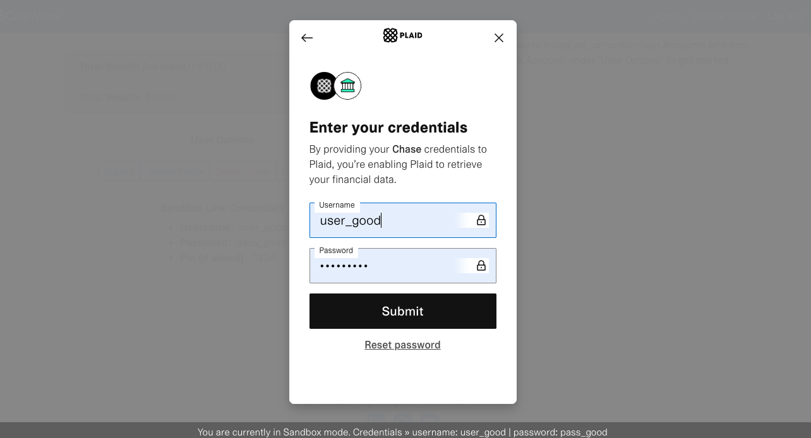

# CashView
### Pull in and view your financial data in one place!

### Description:
This website acts as a personal finance dashboard. It allows users to make a profile and pull financial data from all of their financial institutions into one place. The app itself aggregates balances from all of the user's accounts, displaying their overall worth (with and without loans). It also uses graphics to illustrate the breakdown of the user's financial institutions and what percentage of their overall wealth is in each. Below the dashboard there is an account-level breakdown of each financial institution listed that displays the individual balances based on account type. This was completed in approximately 60 hours as part of Springboard Software Engineering Program.

### Table of Contents
1. [ Tech Stack ](#Tech-Stack)
    - [ Front-end ](#Front-end)
    - [ Back-end ](#Back-end)
    - [ Database ](#Database)
    - [ APIs Integrated ](#APIs)
2. [ Database Schema ](#Schema)
3. [ Deployment ](#Deployment)
4. [ Developer ](#Developer)
5. [ Features ](#Features)
    - [ Registration ](#Registration)
    - [ Login and Demo User ](#LoginAndDemo)
    - [ Adding a Financial Institution ](#AddUFI)

### Tech Stack

#### Front-end
JavaScript, Axios, HTML5, CSS, Bootstrap, jQuery, GoogleChart.js

#### Back-end
Python, Flask, ORM: SQLAlchemy, Jinja2, WTForms, Bcrypt, Cron

#### Database
Postgres

#### APIs integrated
- [ Plaid ](https://plaid.com/docs/api)
- [ Twilio ](https://www.twilio.com/docs)

### Schema

### Deployment
CashView is deployed on heroku at [https://wealth-and-budget.herokuapp.com/](https://wealth-and-budget.herokuapp.com/)

### Developer
#### Bryce Beckenbach

Please feel free to reach out!
- Email: [brycebeckenbach@gmail.com](mailto:brycebeckenbach@gmail.com)
- [ Linkedin ](https://www.linkedin.com/in/bryce-beckenbach-52a5276a/)

### Features:

#### Registration
User Registration goes through the User model on the backend, user enters desired username, password, phone number, first name, last name, and desired account type (sandbox or development (more on that later)). All information is required and username must be unique for the model to generate a User instance. Password is run through Bcrypt hashing function where the output is stored in the database.

#### Login and Demo User
Login authentication occurs on the User model as well. If a User logs in with correct username/password pair, User authenticate method returns the User instance, if not it returns False.

To reduce barrier of entry of someone trying to experience the App, I integrated a 'Demo User' button on the Login page. This uses JavaScript and jQuery behind the scenes to enter credentials:
- Username: Test_User
- Password: pass_good

#### Adding a Financial Institution 
Using the Plaid API, a user can securely add their credentials to Plaid's Link interface that is embedded in the dashboard. **These credentials are not stored in the any area of CashView at any point**. To avoid this being an issue, I made sure users that sign up have the option of having a **development** account, which deals with real bank data, or a **sandbox** account, which deals with dummy bank accounts from Plaid. The Demo user experience is a **sandbox** account as well. 

Once on the dashboard page, a user clicks on 'Link Institution' under 'User Options'.

After the user does this, Plaid's Link interface experience will appear. You will be able to choose your financial institution of choice from a list, then enter the required credentials to pull the data into CashView. If you have a **development** account, you enter your real credentials, if you have a **sandbox** account you enter the information under 'User Options' in the image above (can also be seen at the footer of the Link portal):
- Username: user_good 
- Password: pass_good

If the correct information is entered, CashView will go through the [ Plaid Token exchange process ](https://plaid.com/docs/link/) and receive an **access_token** associated with the specified financial institution. Using this access_token, the app makes two further API calls to Plaid:
1. To retrieve data on the financial institution (called an 'item' in Plaid's vernacular)
2. To retrieve data on accounts held by that financial institution

1. Full CRUD on all resources (User, UserFinancialInstitution, Account, BudgetTracker)
3. Capability to securely pull financial institutions into application through Plaid 
4. Displays aggregated information of all financial institutions for quick view, aggregate of all accounts at singular financial institution, and more granular breakdown of each account
5. Displays graphical 3D pie-chart breakdown of where a user's wealth is
6. Capability to create a customized BudgetTracker with desired budget threshold and notification frequency for eligible accounts (type: credit or sub-type: checking)
7. Scheduled auto-update of all accounts, grabbing the most recent account balance information daily
8. Scheduled auto-notification SMS with most up to date 'amount spent' out of 'budget threshold' for users for budget tracking through Plaid and Twilio

Standard User Flow:
1. User signs-up or logs in
2. User views dashboard where they:
    - add their financial institution/s
    - create/update BudgetTrackers for desired accounts
    - update their user profile information 
    - logout or delete profile

Notes:
1. Job Scheduling:
    - Script is scheduled to run on Heroku
    - If you choose to run this locally, include following code in main app and follow directions below:
        - code:
            **Dependencies to import**
            from flask_crontab import Crontab
            from CronJobs.UFI_jobs import scheduled_daily_refresh_all_accounts
            from CronJobs.BudgetTracker_jobs import scheduled_budget_tracker_jobs
            ** Initializations ***
            crontab = Crontab(app)
            **CRON schedule function definition**
            @crontab.job(minute=0, hour=12)
            def scheduled_jobs():
               scheduled_daily_refresh_all_accounts(plaid_inst)
               scheduled_budget_tracker_jobs(plaid_inst, twilio_inst)
        - directions:
            CRON Scheduled Jobs For local server
            **This will run everyday at 12pm UTC**
            run 'flask crontab add' in command line to initialize
            **This will delete the CRON job**
            run 'flask crontab remove' in command line to remove
            **These are additional command line commands to navigate jobs**
            'crontab -l' to see list of jobs
            'crontab -e' to manually edit list of jobs, 'esc' :wq 'enter' to leave list
            